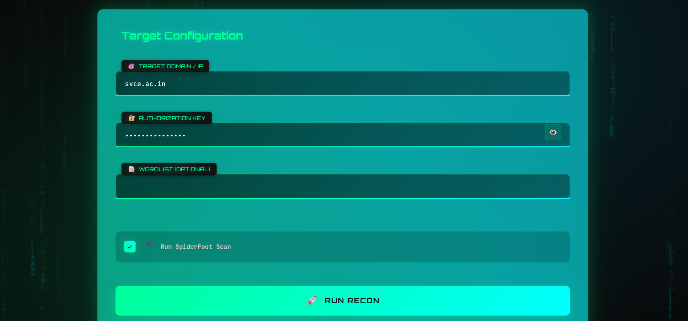

# Red Team Recon Automation Toolkit





A powerful, user-friendly OSINT (Open-Source Intelligence) reconnaissance toolkit designed for red teaming and cybersecurity professionals. This project automates domain reconnaissance, subdomain enumeration, port scanning, tech stack detection, and more, with a sleek cyberpunk-inspired frontend for intuitive interaction. Built with Flask in the backend and HTML/CSS/JS in the frontend, it minimizes dependencies while leveraging popular tools like theHarvester and SpiderFoot.

## Features
- **Automated Reconnaissance**: Scan domains for subdomains, IPs, open ports, services, tech stacks, GitHub/Pastebin leaks, S3 buckets, CVEs, Shodan data, and phishing vectors.
- **Tool Integration**: Uses subprocess calls for tools like theHarvester, SpiderFoot, Sublist3r, and dnstwist, with fallbacks for missing libraries.
- **Frontend Interface**: Cyberpunk-themed UI with Matrix rain background, holographic effects, and accordion results display for an engaging experience.
- **Secure and Configurable**: Supports .env for API keys (Shodan, GitHub, Censys) and authorization key for API access.
- **Output Management**: Saves results as JSON and CSV in `./outputs/<target>/` for easy analysis.
- **Enhanced Scans**: Optional SpiderFoot integration and additional tools like Amass, Nmap, and OpenSSL for comprehensive intel.
- **Cross-Platform**: Runs on Windows, macOS, Linux with minimal setup.

## Installation
### Prerequisites
- Python 3.8+ (for backend)
- Git (to clone the repository)
- Virtual environment tool (e.g., `venv`)
- Optional: System tools like `dig`, `whois`, `nmap` for enhanced functionality
- Browser (for frontend)

### Step-by-Step Setup
1. **Clone the Repository**:
   ```
   git clone https://github.com/yourusername/red-team-recon-toolkit.git
   cd red-team-recon-toolkit
   ```

2. **Set Up Backend**:
   - Navigate to backend:
     ```
     cd backend
     ```
   - Create and activate virtual environment:
     - Windows:
       ```
       python -m venv venv
       venv\Scripts\activate
       ```
     - macOS/Linux:
       ```
       python3 -m venv venv
       source venv/bin/activate
       ```
   - Install dependencies:
     ```
     pip install flask flask-cors requests whois python-dotenv dnspython builtwith shodan sublist3r
     ```
   - Clone required tools (if not already present):
     ```
     git clone https://github.com/laramies/theHarvester.git
     git clone https://github.com/smicallef/spiderfoot.git
     ```
   - Create `.env` file in backend and add your keys:
     ```
     RECON_ALLOWED_KEY=your_auth_key
     SHODAN_API_KEY=your_shodan_key
     GITHUB_TOKEN=your_github_token
     CENSYS_ID=your_censys_id
     CENSYS_SECRET=your_censys_secret
     ```

3. **Set Up Frontend**:
   - The frontend is in the `frontend` folder with HTML, CSS, JS. No additional installation needed—it's static.

4. **Run the Backend**:
   - From the backend folder:
     ```
     python app.py
     ```
   - The server starts on `http://127.0.0.1:5000` (API endpoints) and serves the frontend at `/`.

5. **Access the Toolkit**:
   - Open `http://127.0.0.1:5000` in your browser to use the UI.
   - Use the form to configure and run scans (target, auth key, etc.).

### Troubleshooting Installation
- **Missing Tools**: If subprocess calls fail, ensure cloned tools are in the backend folder and executable.
- **Dependencies**: If a library is missing, the code uses fallbacks (e.g., socket for DNS).
- **Port Conflict**: Change the port in `.env` (e.g., `PORT=5001`) if 5000 is in use.
- **Firewall/Antivirus**: Allow Python subprocesses for tools like SpiderFoot.

## Usage
### Backend API
- **Start Recon**: `GET /api/recon?target=example.com&auth=YOUR_KEY&use_spiderfoot=1&wordlist=path/to/wordlist`
  - Returns JSON with recon results.
- **Check Status**: `GET /api/status/<job_id>?auth=YOUR_KEY`
  - Monitors scan progress.
- **Health Check**: `GET /api/health`
  - Verifies dependencies and config.
- **Tool Test**: `GET /api/tools/test?auth=YOUR_KEY`
  - Tests availability of modules and subprocess tools.

### Frontend Interface
- Enter target domain/IP, auth key, optional wordlist, and toggle SpiderFoot.
- Click "Run Recon" to start the scan.
- Results display in accordions with summary stats, subdomains, hosts, WHOIS, etc.
- Export results as HTML or clear the display.

### Example Scan
1. Fill form: Target = "example.com", Auth Key = "yourkey", SpiderFoot = checked.
2. Submit: The backend performs DNS resolution, subdomain enumeration, port scanning, etc.
3. Results: View JSON/CSV in `./backend/outputs/example_com/` or on the frontend.

## Project Structure
```
red-team-recon-toolkit/
├── backend/              # Flask backend server
│   ├── app.py            # Main Flask app with recon logic
│   ├── .env              # API keys and config (not in Git)
│   ├── outputs/          # Generated scan results (ignored in Git)
│   ├── theHarvester/     # Cloned tool for email/host harvesting
│   ├── spiderfoot/       # Cloned tool for footprinting
│   └── venv/             # Virtual environment (ignored in Git)
├── frontend/             # Cyberpunk-themed UI
│   ├── index.html        # Main HTML page with form and results
│   ├── style.css         # CSS for neon, holographic effects
│   └── script.js         # JS for Matrix effect, form handling, results rendering
├── .gitignore            # Excludes venv, outputs, .env, etc.
└── README.md             # This file
```

## Technical Details
### Backend (Flask)
- **Framework**: Flask with CORS for frontend integration.
- **Recon Logic**: `run_recon` orchestrates scans:
  - DNS resolution: `dnspython` or `dig/socket` fallbacks.
  - Subdomain Enumeration: Sublist3r, CRT.sh, DNS brute-force, theHarvester.
  - Port Scanning: Socket-based or Nmap subprocess.
  - Tech Stack: Builtwith or header guessing.
  - Leaks: GitHub code search, Pastebin, S3 guesses.
  - CVEs: CVE.circl.lu API.
  - Shodan: Shodan library.
  - Phishing: MX records, dnstwist typosquats.
  - SpiderFoot: Optional subprocess for advanced footprinting.
- **Enhanced Features**: Amass for subdomains, Nmap for ports, OpenSSL for SSL info.
- **Output**: JSON/CSV saved in `outputs/<target>/`.
- **Security**: Auth key required for API; use against authorized targets only.

### Frontend (HTML/CSS/JS)
- **UI Design**: Cyberpunk theme with Matrix rain background, holographic text, glowing inputs, and accordion results.
- **JavaScript**: Handles form submission, renders results, export/clear, and Matrix animation.
- **Integration**: Fetches from backend API `/api/recon` and displays in accordions with summary stats.

### Dependencies
- Backend: Flask, Flask-CORS, requests, python-whois, dnspython, builtwith, shodan (optional via pip).
- Tools: Clone theHarvester and SpiderFoot; system tools like dig, whois, nmap.
- Frontend: Pure HTML/CSS/JS (no dependencies).

### Configuration
- **.env Example**:
  ```
  RECON_ALLOWED_KEY=your_api_auth_key
  SHODAN_API_KEY=your_shodan_key
  GITHUB_TOKEN=your_github_token
  CENSYS_ID=your_censys_id
  CENSYS_SECRET=your_censys_secret
  PORT=5000
  ```
- **Customization**: Adjust `TOP_PORTS` or `DEFAULT_WORDS` in `app.py` for scans.

## Contributing
1. Fork the repo.
2. Create a branch (`git checkout -b feature/your-feature`).
3. Commit changes (`git commit -m "Add your feature"`).
4. Push (`git push origin feature/your-feature`).
5. Open a Pull Request.

We welcome contributions to improve tools, UI, or docs!

## Contact
- GitHub: Karthikeyan https://github.com/S-Karthikeyan-17
- Email: su.karthikeyan17@gmail.com

